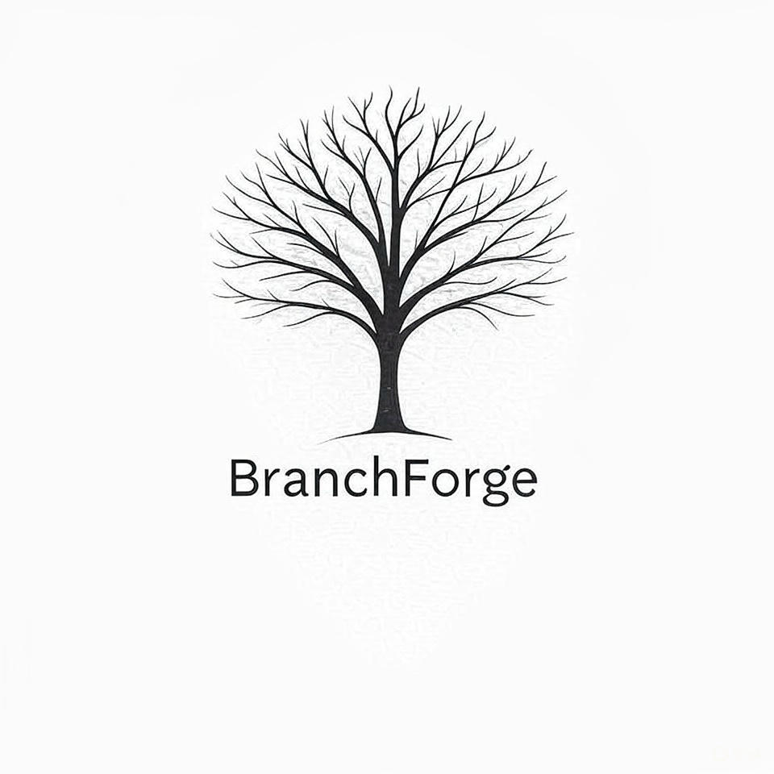
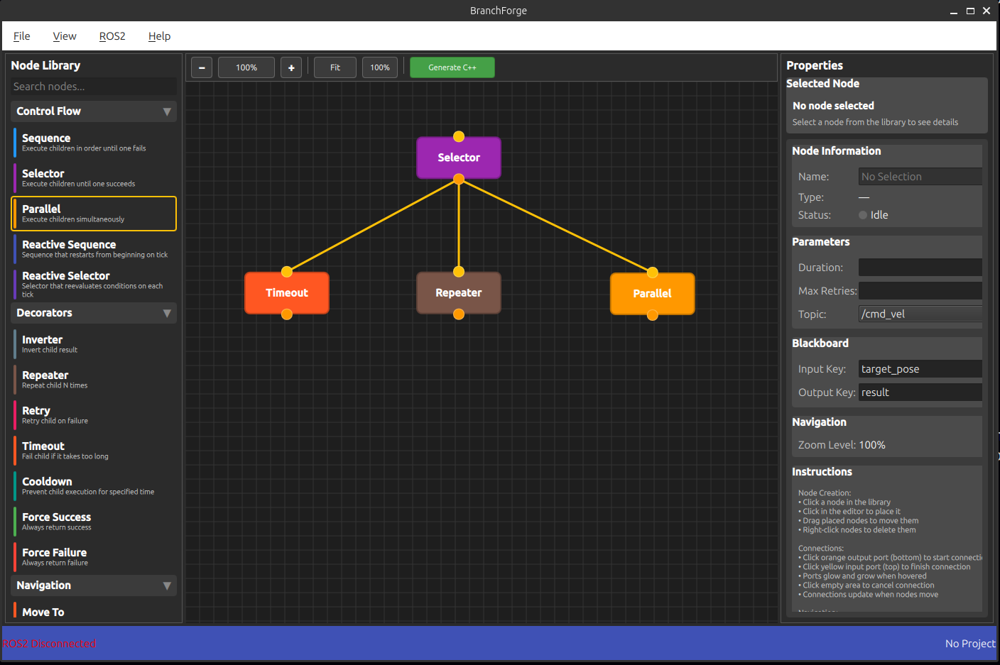

# BranchForge

A comprehensive open-source development platform for designing, visualizing, testing, and debugging Behaviour Trees (BTs) for ROS2 robotics applications.

## Features

- **Visual BT Editor**: Drag-and-drop interface for behavior tree design
- **ROS2 Integration**: Native integration with ROS2 ecosystem
- **Modern C++20**: Built with latest C++ standards and Qt6
- **Modular Architecture**: Extensible with Python/C++ plugins
- **Real-time Monitoring**: Live BT execution visualization (planned)
- **Code Generation**: Export to production-ready C++20 code



## Quick Start

### Prerequisites
- Ubuntu 22.04 LTS or newer
- Qt6 development packages
- ROS2 (Humble, Iron, Jazzy, or Rolling) - optional
- CMake 3.20+
- C++20 compatible compiler

### Install Dependencies
```bash
sudo apt update
sudo apt install -y qt6-base-dev qt6-declarative-dev cmake build-essential
```

### Build
```bash
mkdir build && cd build
cmake ..
make -j$(nproc)
```

### Run
```bash
./branchforge_simple
```

## Development Status

Currently in **Phase 1** development with basic UI framework and project structure complete. See `branchforge_dev_plan.md` for full roadmap.

## License

MIT License - see `LICENSE` file for details.
